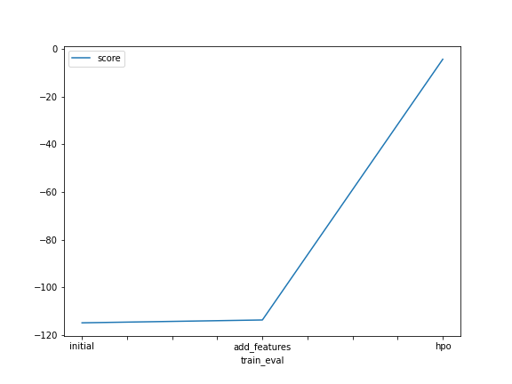
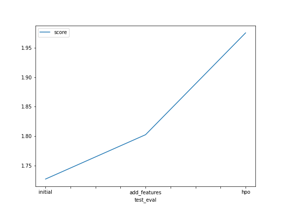

# Report: Predict Bike Sharing Demand with AutoGluon Solution
Sara Lane

## Initial Training
### What did you realize when you tried to submit your predictions? What changes were needed to the output of the predictor to submit your results?
Kaggle submissions can't accept negative numbers, so I needed to change all negative values to 0 before submitting.

### What was the top ranked model that performed?
WeightedEnsemble_L3 

## Exploratory data analysis and feature creation
### What did the exploratory analysis find and how did you add additional features?
I used histograms to show the distribution of each feature and decided to split the datetime feature into 3 columns: day, month and year.

### How much better did your model preform after adding additional features and why do you think that is?
After adding additional features, the model achieved a score of 1.80244 as opposed to its previous score of 1.72711. Splitting the datetime into individual columns allowed the data to train better, perhaps because it was able to better predict the ebb and flow of bike sharing based on months in the year and days in the month. For example, months with holidays would have higher numbers and winter months might have lower numbers. 

## Hyper parameter tuning
### How much better did your model preform after trying different hyper parameters?
After training for 7 minutes instead of 5, and not ignoring the columns "casual" and "registered", as well as including hyperparameters for the XGB and GBM algorithms, the model achieved a score of 1.97488.

### If you were given more time with this dataset, where do you think you would spend more time?
I would train it for longer and I would also include more algorithms in the hyperparameters.

### Create a table with the models you ran, the hyperparameters modified, and the kaggle score.

model	hyperparameters	ignored_columns	time_limit	score
0	initial		[casual, registered]	600	1.72711
1	add_features		[casual, registered]	600	1.80244
2	hpo	XGB|GBM		720	1.97488

### Create a line plot showing the top model score for the three (or more) training runs during the project.

### Create a line plot showing the top kaggle score for the three (or more) prediction submissions during the project.

## Summary
I started this project with a benchmark run using basic parameters, and achieved a score of 1.72711. After doing some feature exploration, I split the datetime column into day,time and month features and increased my score to 1.80244. Then I added hyperparameters for the XGB and GBM algorithms and increased the training time to achieve a score of 1.97488. I think that increasing the training time could help improve the score even more, as well as experimenting with more algorithms.
